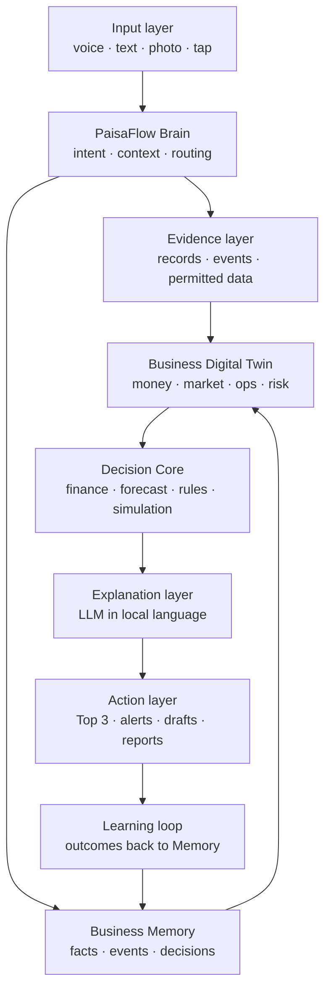

# PaisaFlow — Product Requirements Document

|  |  |  |
| --- | --- | --- |
|  |  |  |
|  |  |  |

2026-09-17 · @Someone

**AI-Driven Hyper-Local Business Advisory and Financial Structuring Assistant for Rural Micro-Entrepreneurs**

*TALK → UNDERSTAND → MODEL → PREDICT → SIMULATE → ACT → LEARN*

## 0. Document Control and PRD at a Glance

PaisaFlow is a voice-first AI Business Companion that maintains a living Business Digital Twin of a rural micro-enterprise and lets the owner test a decision before acting on it.

| Field | Value |
| --- | --- |
| Problem statement | SIH26091 |
| Category | Software · FinTech |
| Version | 1.0 (detailed rebuild) |
| Date | 17 September 2026 |
| Primary stack | Python + FastAPI + PostgreSQL/PostGIS + Web/PWA |
| Core innovation | Business Digital Twin + Evidence Layer + What-if Simulation |
| Product type | Decision-support system (not a lender, accountant, legal authority or guarantee engine) |

**At a glance**

| Dimension | Summary |
| --- | --- |
| Who | Rural and semi-urban micro-entrepreneurs and small business owners who are comfortable with voice but not with spreadsheets, dashboards or financial jargon |
| What | A voice-first AI Business Companion that understands a business, models it, predicts and simulates outcomes, and recommends actions |
| Core object | Business Digital Twin — a continuously updated structured representation of money, market, operations, customers, inventory, financing and risk |
| Core intelligence | Evidence layer + deterministic finance engine + prediction/risk models + what-if scenario simulation |
| Core UX | Simple language, one question at a time, icons, voice input/output, actionable outputs |
| Core loop | TALK → UNDERSTAND → MODEL → PREDICT → SIMULATE → ACT → LEARN |
| SIH MVP | Voice onboarding + Business Memory + Digital Twin + cash-flow engine + loan/expansion simulation + evidence display + Top 3 Actions + basic alerts |

**Reading guide**

- Sections 1–6 define why the product exists, who it serves and how it should feel.
- Sections 7–14 define what the system is made of: architecture, requirements, features, modules, data model, evidence rules and simulation engine.
- Sections 15–19 define the accessibility, action, data, quality and safety constraints.
- Sections 20–27 define scope, delivery plan, metrics, testing, risks, differentiation and the SIH demo.

## 1. Executive Summary

PaisaFlow replaces the question "Can I get this loan?" with "Can my business survive this loan?" — and answers it in the entrepreneur's own language, using the entrepreneur's own numbers.

**The product.** PaisaFlow is a voice-first AI Business Companion for rural and semi-urban entrepreneurs who are not comfortable with conventional business software, long forms, dashboards or financial terminology. The user speaks naturally about a business, a goal or a financial decision (for example, "Mere paas ₹1 lakh hai, main dairy expand karna chahta hoon") and receives a simple, explainable response that ends in concrete next actions.

**The central innovation: the Business Digital Twin.** Instead of answering isolated questions, PaisaFlow builds and maintains a continuously updated representation of the business. The Twin combines approved business information, timestamped business events, financial state, operational state and any available local or evidence signals. Every analysis, forecast and recommendation reads from the Twin, and every approved outcome writes back to it, so the system becomes more accurate the longer the business uses it.

**The decision layer.** A simulation engine runs decisions against the Twin — expansion, borrowing, demand decline, cost increases, delayed payments and seasonal stress — and produces base, downside and growth scenarios. All financial arithmetic is performed by deterministic code, never by the language model. The language model only explains validated results in plain, local language.

**The trust boundary.** PaisaFlow is a decision-support system. It is not a lender, an accountant, a legal authority or a guarantee engine. Every important output is shown as a calculation or a scenario estimate with its assumptions and evidence attached. The system must never present a simulated result as a guaranteed approval, profit or future performance.

**Why it matters for SIH26091.** The problem statement asks for hyper-local business advisory and financial structuring for rural micro-entrepreneurs. Existing tools are either generic chatbots (plausible but unsupported), EMI calculators (numbers without context) or loan finders (eligibility without survivability). PaisaFlow is differentiated by a persistent business state, evidence-aware reasoning, scenario simulation and a low-literacy voice UX that closes the loop from conversation to action to learning.

**What the SIH MVP delivers.** Voice onboarding, a business profile, Business Memory, the Digital Twin, a basic cash-flow engine, a loan/expansion what-if simulator, a business health report, Top 3 Actions, evidence and assumption display, basic alerts and seeded demo data — enough to run the full dairy-expansion scenario end to end in a 90-second demo.

## 2. Product Vision and Positioning

**Vision.** Make sophisticated business intelligence accessible through a simple conversation, so that a micro-entrepreneur with no accounting background can make decisions with the same clarity as a business with a finance team.

**Positioning.** PaisaFlow is the *pre-decision intelligence layer* for small businesses. It sits before the lender, before the supplier order and before the expansion — understand the business, test the decision, then act.

**Core promise (user-facing).** "Aapko business software samajhne ki zaroorat nahi. PaisaFlow aapke business ko samjhega." — You don't need to understand business software. PaisaFlow will understand your business.

**Signature reframing.** Every competing tool answers "Can I get this loan?". PaisaFlow answers "Can my business survive this loan?" — under normal conditions, under a 20% sales drop, under a 15% cost rise and through the lean season.

**Seven-word loop.** TALK → UNDERSTAND → MODEL → PREDICT → SIMULATE → ACT → LEARN. Every feature in this PRD maps to at least one stage of this loop.

| Loop stage | What happens | Owning component |
| --- | --- | --- |
| Talk | User speaks a goal, fact or question | Input layer |
| Understand | Intent and entities are extracted; only essential follow-ups are asked | PaisaFlow Brain |
| Model | Approved facts become or update the Business Digital Twin | Business Memory + Twin |
| Predict | Cash-flow, demand and risk are projected from the Twin | Decision Core (finance + forecast) |
| Simulate | Decisions are tested under base, downside and growth scenarios | Simulation engine |
| Act | Top 3 Actions, drafts and reminders are offered; user approves | Action layer |
| Learn | Outcomes are recorded as events and update the Twin | Learning loop |

**Product philosophy.** Simple outside, sophisticated inside. The user sees one question, one card, three actions. The system behind it runs deterministic finance, provenance tracking and scenario simulation.

## 3. Problem Definition

Rural micro-entrepreneurs make high-stakes capital decisions with informal records, fragmented information and no understandable analysis — and the tools built for them assume literacy and vocabulary they do not have.

**3.1 The entrepreneur's situation**

- Records are informal: a khata notebook, memory, or WhatsApp messages. Revenue, expenses and receivables are rarely consolidated.
- Financial literacy is limited. Terms such as margin, working capital, EMI burden and cash buffer are not part of everyday vocabulary.
- Information is fragmented across suppliers, customers, family members and local market observation.
- Access to understandable business analysis is close to zero. A chartered accountant or bank officer speaks a different language and serves a different goal.

**3.2 The decision gap**

An entrepreneur often knows *that* capital or expansion is needed but cannot estimate:

- the cash-flow impact of a new loan across the year, including lean months;
- the level of local competition and whether demand actually exists for the extra capacity;
- inventory and working-capital needs that come with expansion;
- repayment pressure relative to realistic, not optimistic, sales;
- the downside — what happens if sales fall, costs rise or a large customer pays late.

**3.3 Why existing tools fail**

| Tool type | What it does | Why it is insufficient |
| --- | --- | --- |
| Dashboards and accounting apps | Show financial reports | Assume typing, data entry discipline and financial vocabulary |
| EMI / loan calculators | Compute instalments | Numbers without business context; no survivability view |
| Loan finders and marketplaces | Check eligibility | Optimise for disbursement, not for whether the business can sustain repayment |
| Generic chatbots / generic RAG | Answer questions | Produce plausible-sounding numbers without local evidence; no persistent business state |
| Translation-only tools | Convert jargon to local language | Translate words, not concepts; the user still cannot act |

**3.4 The AI-specific risk**

Generative AI can produce confident, plausible numbers with no grounding in the user's business or locality. For a financial decision this is worse than no answer. PaisaFlow must therefore distinguish facts, observations, estimates, assumptions and AI explanations, and must keep arithmetic out of the language model.

**3.5 Problem statement (one line)**

Build a voice-first assistant that maintains an evidence-aware model of a rural micro-business and lets the owner test financial and expansion decisions before committing, in language they already use.

## 4. Target Users and Personas

PaisaFlow serves four user types; the primary persona drives every UX decision, and the other three must never add complexity to the primary flow.

| Persona | Who they are | Goals | Constraints | What PaisaFlow must do for them |
| --- | --- | --- | --- | --- |
| Primary — rural micro-entrepreneur | Dairy, kirana, tailoring, agri-input, small manufacturing or service owner in a village or block town; uses WhatsApp voice notes comfortably | Decide on a loan or expansion, keep track of who owes money, know if the business is healthy | No spreadsheets, limited reading, low tolerance for forms, intermittent connectivity, low-end Android phone | Voice-first, one question at a time, read-back confirmation, plain-language explanations, Top 3 Actions |
| Secondary — semi-urban small business owner | Shop or small unit owner in a district town with some smartphone and typing comfort | One system for cash-flow, inventory, payments, market context and expansion | Time-poor, distrustful of jargon, already uses 2–3 apps | Same voice flow plus text and tap inputs, Voice Khata, supplier and customer drafts, simple reports |
| Assisted — authorised facilitator | CSC operator, SHG lead, NGO field worker, bank correspondent or family member with explicit authorisation | Help create or review a business profile for an entrepreneur | Must not silently override the owner; must be auditable | Facilitator mode with scoped access, audit trail, owner approval for consequential changes |
| Family / decision group | Spouse, parent, partner or sibling who co-decides on money | Understand the business situation and the decision being made | May have even lower literacy; needs a summary, not a dashboard | Family report: a one-screen visual and audio summary of health, the decision and the risk |

**Persona vignette — Sunita, dairy owner (primary).** Sunita runs 4 cows in a village near Sheikhpura, sells milk to a local collection centre and two tea shops, and keeps accounts in a notebook. She has ₹1 lakh saved and wants to add 6 cows. A dairy cooperative officer mentioned a ₹9 lakh loan. She wants to know one thing: will the loan sink her in the winter months when milk yield drops? She should be able to get that answer by speaking to PaisaFlow for under five minutes.

**Explicit non-users for v1.** Businesses with formal ERP/accounting, lenders seeking credit scores, and users wanting automated money movement. The product must not be shaped by these groups.

## 5. UX Principles

Eight principles govern every screen; any feature that violates one of them is out of scope for the MVP.

| # | Principle | Rule | Example |
| --- | --- | --- | --- |
| 1 | Voice first | Speaking is the default interaction; typing and tapping are fallbacks, never prerequisites | Home screen has one large "Boliye" button |
| 2 | One question at a time | Ask only the next piece of information required to proceed | After "dairy expand karna hai", ask only "Abhi kitni gaay hain?" |
| 3 | Visual language | Icons, cards, status colours and short sentences replace tables and charts wherever possible | Cash health shown as a green/amber/red card with a one-line reason |
| 4 | Conceptual translation | Explain the financial idea in everyday language using the user's own numbers, not by translating jargon | "Cash buffer" becomes "Agar 2 mahine bikri na ho, aapke paas ₹18,000 bachega" |
| 5 | No-shame UX | Every screen has a "Samajh nahi aa raha" option that gives an example-based explanation, never a definition | Tapping it on the EMI card shows the instalment against a month of milk sales |
| 6 | Action over analytics | Every analysis ends with clear next actions; no screen ends on a number alone | Health report ends with Top 3 Actions |
| 7 | User control | Explicit approval before any external communication or consequential action | Draft to supplier shows a "Bhejein?" button; nothing is sent automatically |
| 8 | Evidence visibility | Important claims show where they came from and how confident the system is | Competition signal shows "Observed 3 dairies within 5 km — updated 12 Sep" |

**Supporting conventions**

- Read back every critical captured value ("Aapne kaha ₹1 lakh — sahi hai?") before it enters the Twin.
- Provide a "Badalna hai" correction path on every confirmation.
- Use ranges rather than false precision when the input is uncertain.
- Keep every spoken response under roughly 20 seconds and every screen under roughly 40 words.

## 6. Core User Journey

The end-to-end journey is eleven steps from opening the app to the Twin learning from a real outcome; the MVP must complete all eleven for the dairy scenario.

The loop from Learn back to Analyse is what makes the Twin persistent: every recorded outcome changes the next analysis.

| Step | User does | System does | Output the user sees |
| --- | --- | --- | --- |
| 1. Enter | Opens PaisaFlow, taps or says "Boliye" | Starts a session, loads existing Twin if any | Listening indicator |
| 2. State goal | "Mere paas ₹1 lakh hai, main dairy expand karna chahta hoon" | Speech-to-text in the user's language | Transcript read back |
| 3. Understand | — | Extracts intent (expansion), business type (dairy), capital (₹1,00,000), financing intent (unknown) | Confirmation card: "Dairy · Expansion · ₹1 lakh apna paisa" |
| 4. Clarify | Answers 3–5 short questions | Asks only for missing essentials: current cows, daily milk, price per litre, main costs, existing loans | One question per screen |
| 5. Build Twin | Confirms values | Creates Business Digital Twin v1 with provenance = user-provided | Twin summary card |
| 6. Analyse | — | Money, Market, Operations and Risk modules compute current state | Health card (green/amber/red) + one-line reason |
| 7. Simulate | "Agar main ₹9 lakh ka loan loon?" or moves a slider | Runs base, sales −20%, cost +15% and seasonal scenarios | Scenario cards with cash buffer and repayment burden |
| 8. Explain | Taps "Samajh nahi aa raha" if needed | LLM explains validated numbers with assumptions and evidence labels | Spoken and written explanation |
| 9. Act | Reviews actions | Ranks actions by urgency, value and confidence | Top 3 Actions |
| 10. Approve | Approves a draft or a change | Gates external sends and consequential state changes | "Bhejein?" / "Save karein?" |
| 11. Learn | Reports what happened later | Records outcome as a business event and updates the Twin | "Aapka business update ho gaya" |

## 7. Product Architecture

PaisaFlow is a layered system in which the language model handles only understanding and explanation; state, arithmetic and simulation live in deterministic, testable layers.

| Layer | Responsibility | Key rule |
| --- | --- | --- |
| Input layer | Capture voice, text, photos or scans of bills/khata pages, and simple tap choices | Every input is confirmed before it becomes a fact |
| PaisaFlow Brain | Detect intent, manage conversation context, route to modules, orchestrate the response | The Brain never computes money; it routes to the Decision Core |
| Evidence layer | Approved business records, timestamped events, permitted external data, official/public documents | Every item carries source type, timestamp and classification |
| Business Memory | Structured facts, transactions, decisions, assumptions, corrections, events and outcomes | Append-only with corrections recorded as new events |
| Business Digital Twin | Current state of money, market, operations, customers, inventory, financing and risk, derived from Memory | Reproducible from Memory at any point in time |
| Decision Core | Deterministic financial calculations, forecasting models, rules, scenario simulation, risk logic | Independently unit-tested; identical inputs give identical outputs |
| Explanation layer | LLM converts validated Decision Core outputs into simple local-language text and speech | Receives numbers as inputs; may not alter or invent them |
| Action layer | Top 3 Actions, alerts, drafts, reports, approval-gated workflows | Nothing external happens without explicit approval |
| Learning loop | Observed outcomes are written back as events, updating Memory and the Twin | Closes TALK → LEARN |

**Reference technical stack**

| Concern | Choice |
| --- | --- |
| Client | Progressive Web App (mobile-first), large-touch UI, Web Speech / cloud STT-TTS |
| API | Python + FastAPI |
| Persistence | PostgreSQL with PostGIS for location-aware market signals |
| AI orchestration | LLM for intent extraction and explanation; deterministic Python for finance and simulation |
| Deployment | Containerised backend; PWA served statically; environment-based secrets |

## 8. Functional Requirements — MVP

Sixteen functional requirements define the SIH MVP; each has a priority (Must / Should) and a testable acceptance criterion.

| ID | Requirement | Priority | Acceptance criterion |
| --- | --- | --- | --- |
| FR-01 | Create a business profile using voice and/or guided inputs | Must | A new user completes a profile (business type, location, capital, main revenue and costs) by voice alone in under 5 minutes |
| FR-02 | Support the selected user language for input and output; prototype may support a limited set (Hindi, Hinglish, English at minimum) | Must | Language is chosen once; all prompts, read-backs and explanations follow it |
| FR-03 | Extract intent and entities: business type, goal, capital, financing intent, quantities, prices | Must | On the seeded utterance set, ≥ 90% of entities are captured without correction |
| FR-04 | Store approved facts and business events with timestamps | Must | Every stored item has source type, timestamp and approval flag; unapproved items never enter the Twin |
| FR-05 | Generate a structured Business Digital Twin from stored information | Must | Twin can be regenerated from Memory and matches the last displayed state |
| FR-06 | Calculate revenue, expenses, cash balance and 12-month projected cash-flow from supplied assumptions/data | Must | Outputs match an independently prepared spreadsheet for the dairy test case to the rupee |
| FR-07 | Simulate a proposed financing amount with configurable rate, tenure, moratorium and disbursement timing | Must | EMI, total interest, monthly repayment burden and minimum cash buffer are shown for any amount the user states |
| FR-08 | Support downside scenarios: sales reduction, cost increase, delayed payments, seasonal shock | Must | Each shock can be applied alone or combined; results update within 2 seconds |
| FR-09 | Generate a small set of prioritised actions (Top 3) | Must | Actions are ranked by urgency, expected value and confidence, and each has a one-line reason |
| FR-10 | Explain important results in simple language with assumptions and evidence | Must | Every scenario card has a spoken and written explanation under 60 words that names its assumptions |
| FR-11 | Provide evidence/provenance for important claims where available | Must | Tapping any important number shows its label (Fact / Observation / Estimate / AI inference), source and date |
| FR-12 | Detect configured events: payment delay, cash pressure, inventory attention | Must | A receivable past its expected date raises an alert on next open |
| FR-13 | Draft customer, supplier and partner messages; require approval before sending | Must | No message leaves the system without an explicit approve action logged with timestamp |
| FR-14 | Generate simple visual/text reports for sharing or printing | Should | A one-page family/facilitator report exports as image or PDF |
| FR-15 | Allow users to correct captured information | Must | "Badalna hai" on any confirmed value creates a correction event; the Twin recomputes |
| FR-16 | Update the Business Twin after approved changes and recorded outcomes | Must | Recording an outcome (e.g. "loan mil gaya", "6 gaay le li") changes the Twin and the next health report |

**Voice-specific requirements**

- FR-V1: Read back every captured monetary value and quantity before storing it.
- FR-V2: Offer a text fallback when speech confidence is low or after two failed recognitions.
- FR-V3: Speak important explanations aloud on request or by default in low-literacy mode.

**Out of scope for MVP (explicit).** Banking integration, automated loan application, autonomous money movement, guaranteed credit scoring, full offline mode and nationwide market coverage.

## 9. Killer Features

Ten features distinguish PaisaFlow; K1 to K5 are Must for the SIH demo, K6 to K10 are Should.

| ID | Feature | What it does | Why it matters | Loop stage | MVP |
| --- | --- | --- | --- | --- | --- |
| K1 | Business Digital Twin | Persistent, evolving model connecting money, market, operations, customers, financing and risk | Every answer is about *this* business, and improves over time | Model | Must |
| K2 | What-if Simulator | Tests expansion, borrowing, demand fall, cost rise and seasonality before a commitment | Turns a gut decision into a tested decision | Simulate | Must |
| K3 | Borrowability / Safe-Repayment View | Separates "might be eligible for ₹X" from "can sustain repayment of ₹Y under stated scenarios" | Prevents over-borrowing; the core reframing of the product | Predict | Must |
| K4 | Voice Khata | Conversational transaction entry: "Ramesh ko ₹850 ka maal diya" becomes a receivable with a date | Removes the data-entry barrier that kills every accounting app | Talk | Should |
| K5 | Evidence Mode | Shows what is known, observed, estimated and assumed, with freshness and confidence | Makes the system trustworthy and auditable; guards against AI fabrication | Understand | Must |
| K6 | Business Experiment Mode | Suggests a small real-world test (e.g. add 1 cow for a month) before the large investment; results feed the Twin | Reduces risk and produces real evidence | Act / Learn | Should |