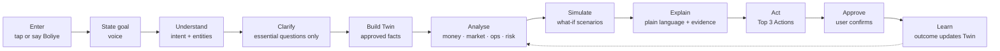
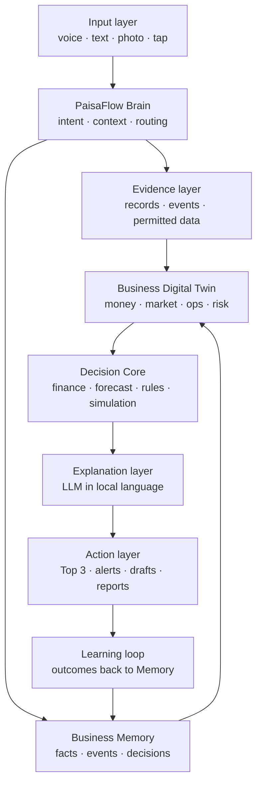
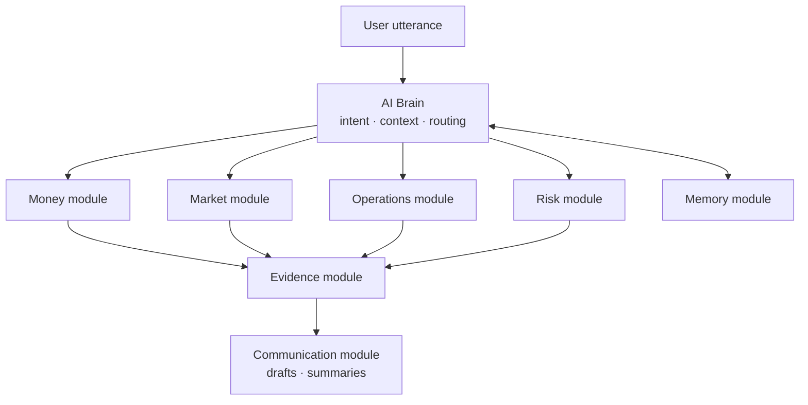
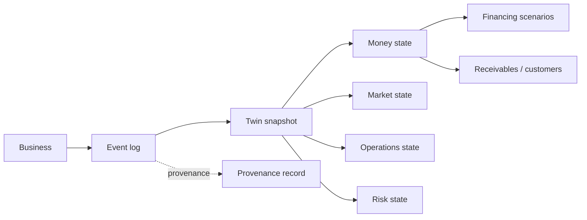
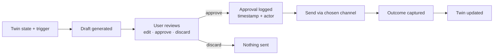

# PaisaFlow — Product Requirements Document

|  |  |  |
| --- | --- | --- |
|  |  |  |
|  |  |  |

2026-09-17 · @Someone

**AI-Driven Hyper-Local Business Advisory and Financial Structuring Assistant for Rural Micro-Entrepreneurs**

*TALK → UNDERSTAND → MODEL → PREDICT → SIMULATE → ACT → LEARN*

## 0. Document Control and PRD at a Glance

PaisaFlow is a voice-first AI Business Companion that maintains a living Business Digital Twin of a rural micro-enterprise and lets the owner test a decision before acting on it.

| Field | Value |
| --- | --- |
| Problem statement | SIH26091 |
| Category | Software · FinTech |
| Version | 1.0 (detailed rebuild) |
| Date | 17 September 2026 |
| Primary stack | Python + FastAPI + PostgreSQL/PostGIS + Web/PWA |
| Core innovation | Business Digital Twin + Evidence Layer + What-if Simulation |
| Product type | Decision-support system (not a lender, accountant, legal authority or guarantee engine) |

**At a glance**

| Dimension | Summary |
| --- | --- |
| Who | Rural and semi-urban micro-entrepreneurs and small business owners who are comfortable with voice but not with spreadsheets, dashboards or financial jargon |
| What | A voice-first AI Business Companion that understands a business, models it, predicts and simulates outcomes, and recommends actions |
| Core object | Business Digital Twin — a continuously updated structured representation of money, market, operations, customers, inventory, financing and risk |
| Core intelligence | Evidence layer + deterministic finance engine + prediction/risk models + what-if scenario simulation |
| Core UX | Simple language, one question at a time, icons, voice input/output, actionable outputs |
| Core loop | TALK → UNDERSTAND → MODEL → PREDICT → SIMULATE → ACT → LEARN |
| SIH MVP | Voice onboarding + Business Memory + Digital Twin + cash-flow engine + loan/expansion simulation + evidence display + Top 3 Actions + basic alerts |

**Reading guide**

- Sections 1–6 define why the product exists, who it serves and how it should feel.
- Sections 7–14 define what the system is made of: architecture, requirements, features, modules, data model, evidence rules and simulation engine.
- Sections 15–19 define the accessibility, action, data, quality and safety constraints.
- Sections 20–27 define scope, delivery plan, metrics, testing, risks, differentiation and the SIH demo.

## 1. Executive Summary

PaisaFlow replaces the question "Can I get this loan?" with "Can my business survive this loan?" — and answers it in the entrepreneur's own language, using the entrepreneur's own numbers.

**The product.** PaisaFlow is a voice-first AI Business Companion for rural and semi-urban entrepreneurs who are not comfortable with conventional business software, long forms, dashboards or financial terminology. The user speaks naturally about a business, a goal or a financial decision (for example, "Mere paas ₹1 lakh hai, main dairy expand karna chahta hoon") and receives a simple, explainable response that ends in concrete next actions.

**The central innovation: the Business Digital Twin.** Instead of answering isolated questions, PaisaFlow builds and maintains a continuously updated representation of the business. The Twin combines approved business information, timestamped business events, financial state, operational state and any available local or evidence signals. Every analysis, forecast and recommendation reads from the Twin, and every approved outcome writes back to it, so the system becomes more accurate the longer the business uses it.

**The decision layer.** A simulation engine runs decisions against the Twin — expansion, borrowing, demand decline, cost increases, delayed payments and seasonal stress — and produces base, downside and growth scenarios. All financial arithmetic is performed by deterministic code, never by the language model. The language model only explains validated results in plain, local language.

**The trust boundary.** PaisaFlow is a decision-support system. It is not a lender, an accountant, a legal authority or a guarantee engine. Every important output is shown as a calculation or a scenario estimate with its assumptions and evidence attached. The system must never present a simulated result as a guaranteed approval, profit or future performance.

**Why it matters for SIH26091.** The problem statement asks for hyper-local business advisory and financial structuring for rural micro-entrepreneurs. Existing tools are either generic chatbots (plausible but unsupported), EMI calculators (numbers without context) or loan finders (eligibility without survivability). PaisaFlow is differentiated by a persistent business state, evidence-aware reasoning, scenario simulation and a low-literacy voice UX that closes the loop from conversation to action to learning.

**What the SIH MVP delivers.** Voice onboarding, a business profile, Business Memory, the Digital Twin, a basic cash-flow engine, a loan/expansion what-if simulator, a business health report, Top 3 Actions, evidence and assumption display, basic alerts and seeded demo data — enough to run the full dairy-expansion scenario end to end in a 90-second demo.

## 2. Product Vision and Positioning

**Vision.** Make sophisticated business intelligence accessible through a simple conversation, so that a micro-entrepreneur with no accounting background can make decisions with the same clarity as a business with a finance team.

**Positioning.** PaisaFlow is the *pre-decision intelligence layer* for small businesses. It sits before the lender, before the supplier order and before the expansion — understand the business, test the decision, then act.

**Core promise (user-facing).** "Aapko business software samajhne ki zaroorat nahi. PaisaFlow aapke business ko samjhega." — You don't need to understand business software. PaisaFlow will understand your business.

**Signature reframing.** Every competing tool answers "Can I get this loan?". PaisaFlow answers "Can my business survive this loan?" — under normal conditions, under a 20% sales drop, under a 15% cost rise and through the lean season.

**Seven-word loop.** TALK → UNDERSTAND → MODEL → PREDICT → SIMULATE → ACT → LEARN. Every feature in this PRD maps to at least one stage of this loop.

| Loop stage | What happens | Owning component |
| --- | --- | --- |
| Talk | User speaks a goal, fact or question | Input layer |
| Understand | Intent and entities are extracted; only essential follow-ups are asked | PaisaFlow Brain |
| Model | Approved facts become or update the Business Digital Twin | Business Memory + Twin |
| Predict | Cash-flow, demand and risk are projected from the Twin | Decision Core (finance + forecast) |
| Simulate | Decisions are tested under base, downside and growth scenarios | Simulation engine |
| Act | Top 3 Actions, drafts and reminders are offered; user approves | Action layer |
| Learn | Outcomes are recorded as events and update the Twin | Learning loop |

**Product philosophy.** Simple outside, sophisticated inside. The user sees one question, one card, three actions. The system behind it runs deterministic finance, provenance tracking and scenario simulation.

## 3. Problem Definition

Rural micro-entrepreneurs make high-stakes capital decisions with informal records, fragmented information and no understandable analysis — and the tools built for them assume literacy and vocabulary they do not have.

**3.1 The entrepreneur's situation**

- Records are informal: a khata notebook, memory, or WhatsApp messages. Revenue, expenses and receivables are rarely consolidated.
- Financial literacy is limited. Terms such as margin, working capital, EMI burden and cash buffer are not part of everyday vocabulary.
- Information is fragmented across suppliers, customers, family members and local market observation.
- Access to understandable business analysis is close to zero. A chartered accountant or bank officer speaks a different language and serves a different goal.

**3.2 The decision gap**

An entrepreneur often knows *that* capital or expansion is needed but cannot estimate:

- the cash-flow impact of a new loan across the year, including lean months;
- the level of local competition and whether demand actually exists for the extra capacity;
- inventory and working-capital needs that come with expansion;
- repayment pressure relative to realistic, not optimistic, sales;
- the downside — what happens if sales fall, costs rise or a large customer pays late.

**3.3 Why existing tools fail**

| Tool type | What it does | Why it is insufficient |
| --- | --- | --- |
| Dashboards and accounting apps | Show financial reports | Assume typing, data entry discipline and financial vocabulary |
| EMI / loan calculators | Compute instalments | Numbers without business context; no survivability view |
| Loan finders and marketplaces | Check eligibility | Optimise for disbursement, not for whether the business can sustain repayment |
| Generic chatbots / generic RAG | Answer questions | Produce plausible-sounding numbers without local evidence; no persistent business state |
| Translation-only tools | Convert jargon to local language | Translate words, not concepts; the user still cannot act |

**3.4 The AI-specific risk**

Generative AI can produce confident, plausible numbers with no grounding in the user's business or locality. For a financial decision this is worse than no answer. PaisaFlow must therefore distinguish facts, observations, estimates, assumptions and AI explanations, and must keep arithmetic out of the language model.

**3.5 Problem statement (one line)**

Build a voice-first assistant that maintains an evidence-aware model of a rural micro-business and lets the owner test financial and expansion decisions before committing, in language they already use.

## 4. Target Users and Personas

PaisaFlow serves four user types; the primary persona drives every UX decision, and the other three must never add complexity to the primary flow.

| Persona | Who they are | Goals | Constraints | What PaisaFlow must do for them |
| --- | --- | --- | --- | --- |
| Primary — rural micro-entrepreneur | Dairy, kirana, tailoring, agri-input, small manufacturing or service owner in a village or block town; uses WhatsApp voice notes comfortably | Decide on a loan or expansion, keep track of who owes money, know if the business is healthy | No spreadsheets, limited reading, low tolerance for forms, intermittent connectivity, low-end Android phone | Voice-first, one question at a time, read-back confirmation, plain-language explanations, Top 3 Actions |
| Secondary — semi-urban small business owner | Shop or small unit owner in a district town with some smartphone and typing comfort | One system for cash-flow, inventory, payments, market context and expansion | Time-poor, distrustful of jargon, already uses 2–3 apps | Same voice flow plus text and tap inputs, Voice Khata, supplier and customer drafts, simple reports |
| Assisted — authorised facilitator | CSC operator, SHG lead, NGO field worker, bank correspondent or family member with explicit authorisation | Help create or review a business profile for an entrepreneur | Must not silently override the owner; must be auditable | Facilitator mode with scoped access, audit trail, owner approval for consequential changes |
| Family / decision group | Spouse, parent, partner or sibling who co-decides on money | Understand the business situation and the decision being made | May have even lower literacy; needs a summary, not a dashboard | Family report: a one-screen visual and audio summary of health, the decision and the risk |

**Persona vignette — Sunita, dairy owner (primary).** Sunita runs 4 cows in a village near Sheikhpura, sells milk to a local collection centre and two tea shops, and keeps accounts in a notebook. She has ₹1 lakh saved and wants to add 6 cows. A dairy cooperative officer mentioned a ₹9 lakh loan. She wants to know one thing: will the loan sink her in the winter months when milk yield drops? She should be able to get that answer by speaking to PaisaFlow for under five minutes.

**Explicit non-users for v1.** Businesses with formal ERP/accounting, lenders seeking credit scores, and users wanting automated money movement. The product must not be shaped by these groups.

## 5. UX Principles

Eight principles govern every screen; any feature that violates one of them is out of scope for the MVP.

| # | Principle | Rule | Example |
| --- | --- | --- | --- |
| 1 | Voice first | Speaking is the default interaction; typing and tapping are fallbacks, never prerequisites | Home screen has one large "Boliye" button |
| 2 | One question at a time | Ask only the next piece of information required to proceed | After "dairy expand karna hai", ask only "Abhi kitni gaay hain?" |
| 3 | Visual language | Icons, cards, status colours and short sentences replace tables and charts wherever possible | Cash health shown as a green/amber/red card with a one-line reason |
| 4 | Conceptual translation | Explain the financial idea in everyday language using the user's own numbers, not by translating jargon | "Cash buffer" becomes "Agar 2 mahine bikri na ho, aapke paas ₹18,000 bachega" |
| 5 | No-shame UX | Every screen has a "Samajh nahi aa raha" option that gives an example-based explanation, never a definition | Tapping it on the EMI card shows the instalment against a month of milk sales |
| 6 | Action over analytics | Every analysis ends with clear next actions; no screen ends on a number alone | Health report ends with Top 3 Actions |
| 7 | User control | Explicit approval before any external communication or consequential action | Draft to supplier shows a "Bhejein?" button; nothing is sent automatically |
| 8 | Evidence visibility | Important claims show where they came from and how confident the system is | Competition signal shows "Observed 3 dairies within 5 km — updated 12 Sep" |

**Supporting conventions**

- Read back every critical captured value ("Aapne kaha ₹1 lakh — sahi hai?") before it enters the Twin.
- Provide a "Badalna hai" correction path on every confirmation.
- Use ranges rather than false precision when the input is uncertain.
- Keep every spoken response under roughly 20 seconds and every screen under roughly 40 words.

## 6. Core User Journey

The end-to-end journey is eleven steps from opening the app to the Twin learning from a real outcome; the MVP must complete all eleven for the dairy scenario.

The loop from Learn back to Analyse is what makes the Twin persistent: every recorded outcome changes the next analysis.

| Step | User does | System does | Output the user sees |
| --- | --- | --- | --- |
| 1. Enter | Opens PaisaFlow, taps or says "Boliye" | Starts a session, loads existing Twin if any | Listening indicator |
| 2. State goal | "Mere paas ₹1 lakh hai, main dairy expand karna chahta hoon" | Speech-to-text in the user's language | Transcript read back |
| 3. Understand | — | Extracts intent (expansion), business type (dairy), capital (₹1,00,000), financing intent (unknown) | Confirmation card: "Dairy · Expansion · ₹1 lakh apna paisa" |
| 4. Clarify | Answers 3–5 short questions | Asks only for missing essentials: current cows, daily milk, price per litre, main costs, existing loans | One question per screen |
| 5. Build Twin | Confirms values | Creates Business Digital Twin v1 with provenance = user-provided | Twin summary card |
| 6. Analyse | — | Money, Market, Operations and Risk modules compute current state | Health card (green/amber/red) + one-line reason |
| 7. Simulate | "Agar main ₹9 lakh ka loan loon?" or moves a slider | Runs base, sales −20%, cost +15% and seasonal scenarios | Scenario cards with cash buffer and repayment burden |
| 8. Explain | Taps "Samajh nahi aa raha" if needed | LLM explains validated numbers with assumptions and evidence labels | Spoken and written explanation |
| 9. Act | Reviews actions | Ranks actions by urgency, value and confidence | Top 3 Actions |
| 10. Approve | Approves a draft or a change | Gates external sends and consequential state changes | "Bhejein?" / "Save karein?" |
| 11. Learn | Reports what happened later | Records outcome as a business event and updates the Twin | "Aapka business update ho gaya" |

## 7. Product Architecture

PaisaFlow is a layered system in which the language model handles only understanding and explanation; state, arithmetic and simulation live in deterministic, testable layers.

| Layer | Responsibility | Key rule |
| --- | --- | --- |
| Input layer | Capture voice, text, photos or scans of bills/khata pages, and simple tap choices | Every input is confirmed before it becomes a fact |
| PaisaFlow Brain | Detect intent, manage conversation context, route to modules, orchestrate the response | The Brain never computes money; it routes to the Decision Core |
| Evidence layer | Approved business records, timestamped events, permitted external data, official/public documents | Every item carries source type, timestamp and classification |
| Business Memory | Structured facts, transactions, decisions, assumptions, corrections, events and outcomes | Append-only with corrections recorded as new events |
| Business Digital Twin | Current state of money, market, operations, customers, inventory, financing and risk, derived from Memory | Reproducible from Memory at any point in time |
| Decision Core | Deterministic financial calculations, forecasting models, rules, scenario simulation, risk logic | Independently unit-tested; identical inputs give identical outputs |
| Explanation layer | LLM converts validated Decision Core outputs into simple local-language text and speech | Receives numbers as inputs; may not alter or invent them |
| Action layer | Top 3 Actions, alerts, drafts, reports, approval-gated workflows | Nothing external happens without explicit approval |
| Learning loop | Observed outcomes are written back as events, updating Memory and the Twin | Closes TALK → LEARN |

**Reference technical stack**

| Concern | Choice |
| --- | --- |
| Client | Progressive Web App (mobile-first), large-touch UI, Web Speech / cloud STT-TTS |
| API | Python + FastAPI |
| Persistence | PostgreSQL with PostGIS for location-aware market signals |
| AI orchestration | LLM for intent extraction and explanation; deterministic Python for finance and simulation |
| Deployment | Containerised backend; PWA served statically; environment-based secrets |

## 8. Functional Requirements — MVP

Sixteen functional requirements define the SIH MVP; each has a priority (Must / Should) and a testable acceptance criterion.

| ID | Requirement | Priority | Acceptance criterion |
| --- | --- | --- | --- |
| FR-01 | Create a business profile using voice and/or guided inputs | Must | A new user completes a profile (business type, location, capital, main revenue and costs) by voice alone in under 5 minutes |
| FR-02 | Support the selected user language for input and output; prototype may support a limited set (Hindi, Hinglish, English at minimum) | Must | Language is chosen once; all prompts, read-backs and explanations follow it |
| FR-03 | Extract intent and entities: business type, goal, capital, financing intent, quantities, prices | Must | On the seeded utterance set, ≥ 90% of entities are captured without correction |
| FR-04 | Store approved facts and business events with timestamps | Must | Every stored item has source type, timestamp and approval flag; unapproved items never enter the Twin |
| FR-05 | Generate a structured Business Digital Twin from stored information | Must | Twin can be regenerated from Memory and matches the last displayed state |
| FR-06 | Calculate revenue, expenses, cash balance and 12-month projected cash-flow from supplied assumptions/data | Must | Outputs match an independently prepared spreadsheet for the dairy test case to the rupee |
| FR-07 | Simulate a proposed financing amount with configurable rate, tenure, moratorium and disbursement timing | Must | EMI, total interest, monthly repayment burden and minimum cash buffer are shown for any amount the user states |
| FR-08 | Support downside scenarios: sales reduction, cost increase, delayed payments, seasonal shock | Must | Each shock can be applied alone or combined; results update within 2 seconds |
| FR-09 | Generate a small set of prioritised actions (Top 3) | Must | Actions are ranked by urgency, expected value and confidence, and each has a one-line reason |
| FR-10 | Explain important results in simple language with assumptions and evidence | Must | Every scenario card has a spoken and written explanation under 60 words that names its assumptions |
| FR-11 | Provide evidence/provenance for important claims where available | Must | Tapping any important number shows its label (Fact / Observation / Estimate / AI inference), source and date |
| FR-12 | Detect configured events: payment delay, cash pressure, inventory attention | Must | A receivable past its expected date raises an alert on next open |
| FR-13 | Draft customer, supplier and partner messages; require approval before sending | Must | No message leaves the system without an explicit approve action logged with timestamp |
| FR-14 | Generate simple visual/text reports for sharing or printing | Should | A one-page family/facilitator report exports as image or PDF |
| FR-15 | Allow users to correct captured information | Must | "Badalna hai" on any confirmed value creates a correction event; the Twin recomputes |
| FR-16 | Update the Business Twin after approved changes and recorded outcomes | Must | Recording an outcome (e.g. "loan mil gaya", "6 gaay le li") changes the Twin and the next health report |

**Voice-specific requirements**

- FR-V1: Read back every captured monetary value and quantity before storing it.
- FR-V2: Offer a text fallback when speech confidence is low or after two failed recognitions.
- FR-V3: Speak important explanations aloud on request or by default in low-literacy mode.

**Out of scope for MVP (explicit).** Banking integration, automated loan application, autonomous money movement, guaranteed credit scoring, full offline mode and nationwide market coverage.

## 9. Killer Features

Ten features distinguish PaisaFlow; K1 to K5 are Must for the SIH demo, K6 to K10 are Should.

| ID | Feature | What it does | Why it matters | Loop stage | MVP |
| --- | --- | --- | --- | --- | --- |
| K1 | Business Digital Twin | Persistent, evolving model connecting money, market, operations, customers, financing and risk | Every answer is about *this* business, and improves over time | Model | Must |
| K2 | What-if Simulator | Tests expansion, borrowing, demand fall, cost rise and seasonality before a commitment | Turns a gut decision into a tested decision | Simulate | Must |
| K3 | Borrowability / Safe-Repayment View | Separates "might be eligible for ₹X" from "can sustain repayment of ₹Y under stated scenarios" | Prevents over-borrowing; the core reframing of the product | Predict | Must |
| K4 | Voice Khata | Conversational transaction entry: "Ramesh ko ₹850 ka maal diya" becomes a receivable with a date | Removes the data-entry barrier that kills every accounting app | Talk | Should |
| K5 | Evidence Mode | Shows what is known, observed, estimated and assumed, with freshness and confidence | Makes the system trustworthy and auditable; guards against AI fabrication | Understand | Must |
| K6 | Business Experiment Mode | Suggests a small real-world test (e.g. add 1 cow for a month) before the large investment; results feed the Twin | Reduces risk and produces real evidence | Act / Learn | Should |
| K7 | Low-Literacy UX | Icons, voice, one-question screens, examples, "Samajh nahi aa raha" | Makes the product usable by the primary persona at all | Talk | Must |
| K8 | Business Health Story | Explains the single biggest issue and why, instead of only a score | A score is not actionable; a story is | Explain | Must |
| K9 | Proactive Alerts | Surfaces payment delays, cash pressure and inventory needs without a query | Moves the product from reactive to companion | Act | Must (basic) |
| K10 | Family / Assisted Mode | Simple visual and audio summary for family; authorised facilitator access | Decisions in micro-businesses are family decisions | Act | Should |

**Feature detail — K3 Borrowability view.** For a proposed loan the view shows three numbers side by side: the monthly repayment, the average monthly surplus in the base case, and the worst-month surplus across downside scenarios. If the worst-month surplus is below the repayment, the card turns red and names the month and the cause (for example, "December: milk yield down 30%, EMI ₹19,500 > surplus ₹12,000"). The card never says "approved" or "eligible".

**Feature detail — K4 Voice Khata grammar.** The extractor must handle: gave goods on credit (`<name> ko ₹<amt> ka maal diya`), received payment (`<name> ne ₹<amt> diye`), bought stock (`₹<amt> ka <item> liya`), paid expense (`₹<amt> <expense> mein gaya`). Each becomes a typed transaction with counterparty, amount, direction, date and expected settlement date where applicable.

## 10. Agent / Module Design

Eight modules make up the intelligence layer; the AI Brain routes, the domain modules compute, and only the Explanation path touches the language model.

| Module | Inputs | Responsibilities | Outputs | Deterministic? |
| --- | --- | --- | --- | --- |
| AI Brain | Transcript, session context, Twin summary | Intent detection, slot filling, next-question selection, routing, response assembly | Structured intent object, module calls, final response | No (LLM + rules) |
| Money module | Twin money state, assumptions | Cash-flow projection, expense and margin analysis, EMI and repayment schedules, financial summaries | Monthly projections, surplus, buffer, repayment burden | Yes |
| Market module | Location, business category, permitted local data, user observations | Hyper-local context, competition signals, demand indicators, price observations, opportunity evidence | Market signals with source, date and confidence | Mostly (rules + data) |
| Operations module | Inventory, suppliers, recurring expenses | Stock levels and movement, reorder needs, supplier terms, operating events | Inventory status, reorder suggestions, operating cost changes | Yes |
| Risk module | Twin + scenario outputs | Stress tests, threshold alerts, uncertainty presentation, trigger evaluation | Risk flags, alert events, worst-case months | Yes |
| Communication module | Twin, action list, user preference | Drafts messages and summaries in the user's language; never sends | Draft text with approve/edit/discard | No (LLM) but approval-gated |
| Memory module | All approved inputs and outcomes | Store and retrieve facts, events, decisions, corrections, outcomes with timestamps | Event log, current fact set, timeline | Yes |
| Evidence module | Every claim from other modules | Attach source type, timestamp, confidence and provenance; enforce labelling | Labelled claims (Fact / Observation / Estimate / AI inference) | Yes |

**Routing rule.** The AI Brain produces a structured intent; if the intent needs a number, the Brain calls a deterministic module and passes the result to the Explanation layer. The Brain may not answer a numeric question from the language model directly.

**Failure behaviour.** If a module cannot answer (missing data), it returns a *needs* list; the Brain converts the first item into the next single question to the user.

## 11. Business Digital Twin — Data Model

The Twin is nine linked entity groups; every value in it carries provenance, and the whole Twin is reproducible from the event log.

| Group | Entities and key fields | Notes |
| --- | --- | --- |
| Identity | `business_id`, owner profile (name, phone, language), category (dairy, kirana, tailoring…), location (village/block/district, lat-long via PostGIS), `created_at` | Location drives the Market module; category drives default assumptions and seasonality templates |
| Money | `cash_on_hand`, revenue streams (name, unit, quantity/period, price, seasonality profile), expenses (name, amount, frequency, fixed/variable), receivables (counterparty, amount, due date, status), payables, financing obligations (lender, principal, rate, EMI, tenure, next due) | All amounts in INR integers (paise avoided); periods normalised to monthly |
| Market | Local signals (type, value, source, date), competitor observations (name/type, distance, date), pricing observations, demand assumptions (base, seasonal multipliers) | Never implies complete coverage; every signal has a freshness date |
| Operations | Inventory items (name, unit, stock, reorder level, unit cost), stock movements, suppliers (name, terms, lead time), recurring operating events | Feeds cost projections and reorder alerts |
| Customers | Only necessary records with consent: name/alias, contact (optional), outstanding, expected payment date, payment history summary | Minimal PII; used for receivable tracking and reminders |
| Financing | Existing and proposed scenarios: amount, rate, tenure, moratorium, disbursement month, purpose, linked assumptions, repayment estimate | A proposed scenario never becomes "existing" without an approved outcome event |
| Risk | Risk indicators (cash buffer months, repayment coverage ratio, concentration), stress results per scenario, uncertainty ranges, trigger conditions and thresholds | Computed, never user-entered |
| Memory | Approved facts, corrections, decisions, actions taken, outcomes, each with `event_id`, type, timestamp, actor (owner/facilitator/system), approval status | Append-only event log; corrections supersede rather than overwrite |
| Provenance | On every value: `source_type` (user / observation / estimate / model), reference (event id, document, dataset), timestamp, `classification`, `confidence` | Enforced by the Evidence module at write time |

**Core entity relationships**

**Twin versioning.** Each approved change produces a new Twin version linked to the event that caused it. The system can answer "what did the business look like before the loan?" by replaying events up to that point.

**Minimum viable Twin for the demo (dairy).** Identity + Money (cash, milk revenue with winter multiplier, feed and labour costs, no existing loan) + one proposed financing scenario (₹9 lakh) + computed Risk. Market and Operations can be seeded.

## 12. Evidence and Trust Framework

Every important value in PaisaFlow carries one of four labels, and the label decides how the value may be presented and used.

| Label | Definition | Example | May be shown as | May feed |
| --- | --- | --- | --- | --- |
| FACT | Information directly supplied by the user and confirmed, or retrieved from a permitted evidence source | "4 gaay hain" confirmed by read-back; an official scheme document | A plain statement | Twin, simulation, actions |
| OBSERVATION | Information collected through a survey, field observation or a recorded business event, timestamped | "3 dairies within 5 km — observed 12 Sep 2026" | Statement with date | Market state, alerts |
| ESTIMATE | A quantity calculated or inferred from explicit, visible assumptions | 12-month cash-flow projection; EMI at 11% | Number with assumptions and range | Simulation, actions (with confidence) |
| AI INFERENCE | A generated interpretation or explanation | "Winter is your risky season because…" | Explanation only, never a verified fact | Explanation layer only |

**Rules**

1. Confidence: attach a confidence label (high / medium / low) whenever estimation uncertainty is material to the decision.
2. Freshness: show the date of any external or market evidence; hide or flag signals older than a configurable threshold (default 90 days).
3. No fabricated precision: where local evidence is incomplete, present ranges ("₹12,000–₹18,000") rather than a single number.
4. Financial safety: every scenario output carries the notice that it is an estimate and does not guarantee financing approval, profitability or future performance.
5. Separation of arithmetic: the language model receives computed numbers as inputs and may not alter, round beyond display rules, or invent numbers.
6. Traceability: tapping any important number reveals its label, source, timestamp and the assumptions behind it.
7. Escalation: if the user asks a question the system cannot support with FACT or ESTIMATE, it says so plainly and suggests what evidence would help (for example, "3 din tak daily bikri bataiye").

**Evidence card layout (UI).** Label chip · value · source line · date · confidence · "Assumptions dekhein" expander. The same card component is reused for Twin values, scenario outputs and market signals so that the trust language is consistent everywhere.

## 13. What-if Simulation Engine

The engine takes the Twin, a proposed decision and a set of explicit assumptions, and returns month-by-month projections for a base case, configurable downside cases and a growth case — deterministically.

**Inputs**

| Input | Source | Examples |
| --- | --- | --- |
| Business state | Twin snapshot | Current cash, revenue streams, costs, receivables, existing loans |
| Proposed decision | User utterance or slider | Loan of ₹9,00,000; add 6 cows; open a second counter |
| Assumptions | Defaults by category, editable by user | Interest rate, tenure, moratorium, yield per cow, price per litre, seasonal multipliers, cost inflation |
| Horizon | Default 12 months, extendable to tenure | 12 / 24 / 36 months |

**Scenario set**

| Scenario | Definition | Default parameters | Purpose |
| --- | --- | --- | --- |
| Base | Current and expected assumptions unchanged | — | Reference case |
| Sales reduction | Revenue quantity or price down by X% | −20% | Demand risk |
| Cost increase | Variable and/or fixed costs up by X% | +15% | Input-price risk |
| Payment delay | Receivables settle N days late | +30 days | Working-capital risk |
| Seasonal decline | Category seasonality applied to specific months | Dairy: Dec–Feb yield −25 to −30% | Timing risk |
| Combined stress | Two or more shocks together | Sales −20% and cost +15% | Worst plausible case |
| Growth | Capacity or customer expansion under explicit assumptions | +6 cows at 8 L/day each | Upside with its own cost side |

**Outputs per scenario, per month**

- Revenue, expenses, operating surplus
- Repayment (EMI) and repayment burden = EMI ÷ operating surplus
- Closing cash and cash buffer in months of fixed cost
- Risk flags: buffer below 1 month, repayment burden above 60%, negative closing cash, worst month name and cause

**Calculation rules**

1. EMI uses the standard reducing-balance formula; moratorium months accrue interest only.
2. Seasonal multipliers are applied to quantity, not price, unless the user states a price effect.
3. Growth scenarios add the expansion's own costs (feed, labour, maintenance) before adding its revenue, with a configurable ramp-up period.
4. Every number is computed in Python with unit tests; the LLM never touches the arithmetic.
5. Results are cached per (Twin version, decision, assumption set) so slider movements return instantly.

**Worked example — dairy (illustrative demo values, all ESTIMATE)**

| Item | Base | Sales −20% | Cost +15% | Winter month |
| --- | --- | --- | --- | --- |
| Monthly revenue (₹) | 78,000 | 62,400 | 78,000 | 55,000 |
| Monthly costs (₹) | 46,000 | 46,000 | 52,900 | 46,000 |
| Operating surplus (₹) | 32,000 | 16,400 | 25,100 | 9,000 |
| EMI on ₹9 lakh, 11%, 5 yrs (₹) | 19,570 | 19,570 | 19,570 | 19,570 |
| Surplus after EMI (₹) | 12,430 | −3,170 | 5,530 | −10,570 |
| Repayment burden | 61% | 119% | 78% | 217% |
| Flag | Amber | Red | Amber | Red |

The engine's conclusion for this example is not "loan rejected" but: "₹9 lakh at these numbers fails in a bad month and in winter; ₹5–6 lakh with a 3-month cash reserve survives all four scenarios." The illustrative figures above are placeholders for the seeded demo dataset and must be replaced by the tested values.

**Explainability.** Each scenario card lists exactly which assumptions changed and shows the delta on surplus and buffer. The user can toggle any shock on or off and see the effect.

**Interactive UX.** Sliders or +/- steppers for loan amount, sales change, cost change and number of new units; a "sab dikhao" button runs the combined stress case.

**Guardrail.** Scenario results are never converted into an unconditional guarantee, approval or eligibility statement. The card copy is reviewed against a banned-phrase list ("approved", "guaranteed", "will earn", "eligible for").

## 14. Low-Literacy and Accessibility Requirements

The primary persona must be able to complete every core task without typing, without reading long text and without understanding financial vocabulary.

| ID | Requirement | Implementation note |
| --- | --- | --- |
| A-01 | Primary interaction possible without typing | Voice input on every screen; tap choices for yes/no and small menus |
| A-02 | Short sentences and familiar vocabulary | Copy limit \~12 words per line; glossary of approved plain-language terms per language |
| A-03 | Large touch targets and meaningful icons | Minimum 56 px targets; icon set validated with 5+ field users |
| A-04 | Speak important explanations aloud | TTS on every explanation card; auto-play in low-literacy mode |
| A-05 | Explain concepts using the user's own numbers | Every concept explanation pulls the user's actual values from the Twin |
| A-06 | Read back critical captured information for confirmation | Amounts, quantities, names and dates are always read back before storing |
| A-07 | "Badalna hai" correction flow on every confirmation | Correction creates an event; no silent overwrite |
| A-08 | "Samajh nahi aa raha" on every explanation | Returns an example-based re-explanation, then a simpler one, then offers a facilitator |
| A-09 | Authorised assisted mode | Facilitator scope, owner approval and audit trail (see section 18) |
| A-10 | Graceful operation under poor connectivity | Queue voice notes and transactions locally; sync when online; clear "offline — save ho jayega" state. Full offline is a later milestone |
| A-11 | Readable typography and contrast | WCAG AA contrast; minimum 18 px body text; high-contrast mode |
| A-12 | Low-end device support | PWA tested on 2 GB RAM Android; no heavy client-side models |

## 15. Communication and Action System

Analysis ends in at most three actions, every outgoing message is a draft until approved, and every completed action feeds an outcome back into the Twin.

**Top 3 Actions — ranking model**

| Factor | Weight (default) | Source |
| --- | --- | --- |
| Urgency | 0.35 | Risk module thresholds and due dates |
| Expected business value | 0.35 | Money module delta (surplus, buffer) |
| Confidence | 0.20 | Evidence module labels on the inputs |
| User preference | 0.10 | Past accept/dismiss behaviour |

Weights are configurable per deployment. Each action carries a one-line reason, the evidence behind it and an approve / snooze / dismiss control.

**Action types**

| Type | Example | Approval needed |
| --- | --- | --- |
| Customer follow-up | "Ramesh ko ₹850 ka reminder bhejein — 12 din late" | Yes, before sending |
| Supplier communication | Draft reorder or price query from inventory state | Yes, before sending |
| Financial adjustment | "Loan ₹9 lakh ki jagah ₹6 lakh consider karein" | No (advice only) |
| Business experiment | "Pehle 1 gaay 1 mahine ke liye add karke dekhein" | No (advice only) |
| Record keeping | "Aaj ki bikri bataiye" | No |
| Report sharing | Family or facilitator summary | Yes, before sharing |

**Draft-first flow**

**Channels.** WhatsApp share-sheet, SMS and email drafts in MVP; native WhatsApp Business API integration is a later phase.

**Outcome capture.** After an action is approved, the system asks at the next session whether it was completed and what happened ("Ramesh ne paisa diya?"). The answer becomes an outcome event.

## 16. Data and Integration Strategy

Phase 1 runs entirely on user-provided, seeded and permitted public data; external integrations arrive only when access, permission and interfaces exist.

| Phase | Data sources | Integration | Status |
| --- | --- | --- | --- |
| Phase 1 (SIH) | User inputs, seeded demo dataset (dairy + 2 other categories), permitted public/official documents for scheme information | None required | MVP |
| Phase 2 | Approved integrations where available: UPI/bank statement upload with consent, WhatsApp Business, local market surveys | Consent-gated connectors | Post-SIH |
| Phase 3 | Verified hyper-local observation network via facilitators; category seasonality datasets | Facilitator data-collection mode | Later |

**Data principles**

- Official information: scheme and rule retrieval uses official documents or authorised sources, stored with source URL, retrieval date and version.
- Local data: use observed or verified signals only; never imply complete local coverage; display coverage metadata ("based on 3 observations in this block").
- Privacy: collect only what the product and the business model need; customer records hold the minimum needed for receivable tracking.
- Data quality: every dataset carries source, update date and coverage; stale data is flagged, not silently used.
- Seed data: the demo dataset is clearly labelled as simulated in the UI and in the evidence cards.

**Category assumption templates.** For each supported business category the system ships default assumptions (yield, price ranges, cost structure, seasonality) labelled ESTIMATE with a source; the user's own numbers always override the template.

## 17. Non-Functional Requirements

The system must feel conversational, compute deterministically and remain auditable; these targets are benchmarked during Phase 10.

| Area | Requirement | Target / rule |
| --- | --- | --- |
| Performance | Voice interactions feel conversational | Speech-to-response under \~3 s on 4G for simple intents; simulation re-run under 2 s; exact latency benchmarked in implementation |
| Reliability | Core calculations deterministic and independently testable | 100% of finance and simulation functions covered by unit tests with known-answer cases |
| Scalability | Backend supports many businesses and locations without coupling logic to UI | Stateless API, business-scoped data, background jobs for alerts |
| Security | Authenticated sessions, encrypted transport, least privilege, secure secrets | OTP/phone auth, TLS everywhere, role-based access, secrets in environment or vault |
| Auditability | Important inputs, scenario assumptions and approvals traceable | Immutable event log with actor and timestamp; approvals stored as events |
| Maintainability | Separate AI orchestration, business logic, simulation, evidence and persistence | Five packages with defined interfaces; no LLM calls inside finance code |
| Accessibility | Large controls, contrast, typography, voice | Section 14 requirements A-01 to A-12 |
| Observability | Log errors and metrics without logging sensitive content | Structured logs; transcripts and amounts redacted in logs; latency and error dashboards |
| Localisation | Language packs for prompts, labels and explanations | Hindi, Hinglish, English in MVP; framework supports more |
| Data retention | Business data retained while the account is active | Deletion workflow completes within a defined window; backups encrypted |

## 18. Security, Privacy and Safety

PaisaFlow handles a family's livelihood data, so consent, minimisation, approval gates and honest labelling are requirements, not options.

**Consent and data minimisation**

- Obtain explicit consent, in the user's language and by voice where needed, before storing business information and before enabling any optional integration.
- Collect only what is needed; customer records hold the minimum for receivable tracking; no Aadhaar, PAN or bank credentials in MVP.
- Provide correction and deletion workflows; deletion removes personal data and anonymises the event log where legally permissible.

**Access control**

| Role | Can | Cannot |
| --- | --- | --- |
| Owner | Everything on own business; approve actions; grant/revoke facilitator | — |
| Facilitator (authorised) | Create/review profile, enter data, view reports, propose changes | Approve external sends or consequential changes without owner confirmation; export data |
| Family viewer | View family report | Edit anything |
| System | Compute, alert, draft | Send, submit or move money |

**Safety rules**

1. Explicit approval before any external message, submission or consequential action; approvals are logged events.
2. Estimates, assumptions and limitations are labelled on every relevant card (section 12).
3. The LLM never performs financial calculations when deterministic logic can; outputs are validated before display.
4. Banned-phrase check on all user-facing copy: no "approved", "guaranteed", "eligible", "will earn".
5. Human escalation: when a decision is high-stakes and evidence is low-confidence, the system recommends consulting a facilitator, cooperative officer or bank official and can draft the questions to ask.
6. Audit trail for all approvals and major business-state changes, retained with the event log.

**Threat considerations.** Account takeover via shared phones (mitigate with PIN/voice re-confirmation for approvals), facilitator overreach (scoped roles + owner notification), prompt injection through pasted or scanned text (evidence layer treats OCR content as data, never instructions).

## 19. MVP Scope for SIH

The SIH build is scoped with MoSCoW so the demo runs end to end on the dairy scenario without depending on any external integration.

| Priority | Scope items |
| --- | --- |
| Must have | Voice onboarding · business profile · Business Memory · Digital Twin · basic 12-month cash-flow · loan/expansion what-if simulator with base, sales −20%, cost +15% and seasonal cases · business health story · Top 3 Actions · evidence/assumption display · basic alerts (payment delay, cash pressure) · seeded demo data · correction flow |
| Should have | Voice Khata · bill/khata OCR · family report · business experiment mode · facilitator mode · multilingual output beyond Hindi/English |
| Could have | Hyper-local opportunity map (PostGIS) · supplier intelligence · advanced demand model · WhatsApp Business integration · richer notifications |
| Won't have (first demo) | Full banking integration · automated loan application · autonomous money movement · guaranteed credit scoring · complete offline operation · nationwide market coverage |

**Definition of done for the SIH MVP**

- [ ] A new user creates a dairy profile by voice in under 5 minutes
- [ ] The Twin is displayed and can be corrected
- [ ] "Agar main ₹9 lakh ka loan loon?" returns four scenario cards with evidence labels
- [ ] Top 3 Actions appear with reasons; a draft message requires approval
- [ ] Recording an outcome updates the Twin and the health story
- [ ] All finance functions pass known-answer unit tests
- [ ] The 90-second demo script (section 25) runs without manual intervention

## 20. Implementation Phases

Ten phases take the product from foundation to SIH hardening; phases 1–8 are on the critical path for the demo, 9 improves field usability, 10 is stabilisation.

| Phase | Name | Deliverables | Depends on | Exit criterion |
| --- | --- | --- | --- | --- |
| 1 | Foundation | PWA shell, FastAPI backend, PostgreSQL/PostGIS schema, OTP auth, business profile CRUD | — | Profile created and read via API and UI |
| 2 | Voice experience | STT/TTS integration, intent and entity extraction, guided one-question flow, read-back confirmation | 1 | Dairy onboarding by voice completes |
| 3 | Business Memory | Facts, events, transactions, corrections, timeline view | 1 | Event log replays to the same state |
| 4 | Digital Twin | Money, market, operations, financing and risk state derived from Memory; Twin versioning | 3 | Twin regenerates from events |
| 5 | Finance engine | Cash-flow projection, EMI and repayment schedules, scenario data structures, unit tests | 4 | Known-answer tests pass |
| 6 | Simulation | Base, downside, growth and combined scenarios; scenario cards and sliders | 5 | Four scenario cards render for ₹9 lakh case |
| 7 | Evidence layer | Provenance on every value, labels, confidence, freshness, assumption display, banned-phrase check | 4, 6 | Every important number has a tappable evidence card |
| 8 | Actions and alerts | Top 3 ranking, reminders, drafts, approval gate, outcome capture | 6, 7 | Draft blocked until approved; outcome updates Twin |
| 9 | Field UX | Low-literacy refinement, facilitator mode, Voice Khata, OCR | 2, 8 | 5 field users complete core flow with minimal help |
| 10 | SIH hardening | Seed demo data, adversarial and failure tests, latency benchmarks, explainability review, presentation flow | All | Demo script runs clean 3 times in a row |

**Team split (suggested).** Backend/finance engine · AI orchestration and voice · PWA and UX · data, evidence and demo content · testing and presentation.

## 21. Success Metrics

Eight metrics measure whether the product works for its primary persona; targets are for the SIH demo cohort and should be re-baselined in the field.

| Metric | Definition | MVP target | How measured |
| --- | --- | --- | --- |
| Activation | % of test users creating a business profile without tutorial assistance | ≥ 80% | Onboarding logs |
| Voice task completion | % completing a core task (profile, simulation, action) by voice | ≥ 75% | Session logs |
| Extraction accuracy | % of entities captured correctly without correction | ≥ 90% on seeded set | Correction events ÷ extractions |
| Simulation correctness | Deterministic outputs match independently verified test cases | 100% | Unit and known-answer tests |
| Action usefulness | User/facilitator rating that actions are understandable and relevant | ≥ 4 / 5 | In-app rating after Top 3 |
| Evidence coverage | % of important claims showing source/assumption metadata | 100% | Automated card audit |
| Approval safety | % of consequential actions blocked until explicit approval | 100% | Safety tests and logs |
| State continuity | Twin state reproducible and explainable after new events | 100% | Replay tests |

**Leading indicators post-SIH.** Weekly returning users, Voice Khata entries per user per week, actions approved vs dismissed, outcomes recorded.

## 22. Testing Strategy

Testing concentrates on three failure classes: wrong numbers, unsafe outputs and flows the primary persona cannot complete.

| Level | Scope | Examples |
| --- | --- | --- |
| Unit | Financial formulas, scenario engine, state updates, validation | EMI at 11%/60 months; seasonal multiplier application; correction supersedes original |
| Integration | Voice → intent → memory → twin → simulation → explanation | Dairy utterance produces four scenario cards with correct numbers |
| Data | Schema constraints, timestamps, provenance, correction | Every stored value has provenance; event log ordering |
| UX | Users unfamiliar with business software complete core flows with minimal assistance | 5 field testers, think-aloud, task completion time |
| Adversarial | Missing data, contradictory inputs, unrealistic numbers, ambiguous voice, unsupported local claims | "₹1 lakh" then "₹10 lakh"; "1 crore litre milk"; competitor question with no local data |
| Safety | No guarantees from estimates; no external sending without approval | Banned-phrase scan; attempted send without approval is rejected |
| Demo | Full dairy scenario from first voice input to simulation, action and memory update | Scripted run with timing |

**Known-answer test set.** A spreadsheet of at least 10 business cases (dairy, kirana, tailoring) with hand-verified cash-flow, EMI and scenario results is the oracle for the finance engine; it is version-controlled with the code.

## 23. Key Risks and Mitigations

Eight risks could undermine the product or the demo; each has an owner-level mitigation built into the requirements above.

| Risk | Likelihood | Impact | Mitigation | Where in PRD |
| --- | --- | --- | --- | --- |
| Insufficient hyper-local data | High | Medium | Evidence labels, ranges, confidence; start with permitted/simulated data; facilitator-collected observations later | §12, §16 |
| LLM hallucination of numbers or facts | High | High | Deterministic engines for all arithmetic; evidence boundaries; banned-phrase check | §7, §12, §18 |
| Low literacy blocks adoption | High | High | Voice-first UX, icons, examples, read-back, assisted mode | §5, §14 |
| Poor speech recognition in dialects/noise | Medium | High | Confirmation and correction flows, text fallback, constrained questions, dialect test set | §8 FR-V1–V3 |
| Over-complex product | Medium | Medium | One-question screens; Top 3 Actions; MoSCoW discipline | §5, §19 |
| Financial harm from misread outputs | Low | Very high | Scenario framing, assumptions, safety notices, approval gates, human escalation | §12, §18 |
| Privacy breach or misuse | Low | High | Minimisation, consent, role scoping, audit log, redacted logs | §17, §18 |
| Overpromising in pitch or UI | Medium | High | No guaranteed profit, approval or predictive certainty anywhere; copy review | §12, §25 |

## 24. Competitive Differentiation Strategy

PaisaFlow does not compete on chat, RAG, EMI maths or translation; it competes on a persistent, evidence-aware model of one business and the ability to test decisions against it.

| Do not compete on | Compete on |